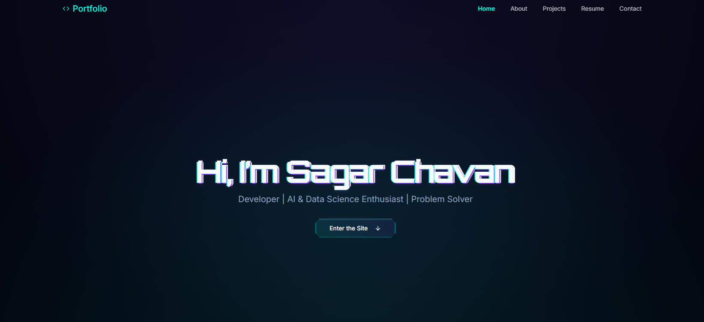

# Portfolio - Sagar Chavan's Personal Portfolio



Welcome to the repository for my personal portfolio, **Portfolio**. This project is a futuristic, sci-fi themed showcase of my skills, projects, and experience as a developer and AI/Data Science enthusiast. It's built with Next.js and Tailwind CSS, featuring a dynamic and interactive user interface.

**[🚀 View Live Demo](https://Portfolio.example.com)** (Replace with your actual deployment link)

## ✨ Features

- **Futuristic UI/UX:** A unique, gaming-inspired design with custom animations, hover effects, and a responsive layout.
- **Interactive Sections:** Smooth-scrolling navigation through different sections:
  - **Hero:** An eye-catching introduction with a glitch text effect.
  - **About:** A summary of my background, skills, and expertise with progress bars.
  - **Projects:** A grid of my key projects with descriptions, tech stacks, and links to GitHub and live demos.
  - **Resume:** Easy access to view or download my resume.
  - **Contact:** A functional contact form and links to my social profiles.
- **Responsive Design:** Fully optimized for a seamless experience on desktops, tablets, and mobile devices.
- **Performance Optimized:** Built with Next.js for fast page loads and a smooth user experience.

## 🛠️ Tech Stack

This portfolio is built with a modern, production-ready tech stack:

- **Framework:** [Next.js](https://nextjs.org/) (React)
- **Styling:** [Tailwind CSS](https://tailwindcss.com/) with custom themes and animations.
- **UI Components:** [ShadCN UI](https://ui.shadcn.com/)
- **Animations:** CSS transitions and keyframes for a dynamic feel.
- **Icons:** [Lucide React](https://lucide.dev/)
- **Deployment:** Vercel / Firebase Hosting

## 🚀 Getting Started

To run this project locally, follow these steps:

1.  **Clone the repository:**
    ```bash
    git clone https://github.com/sagarc123/Portfolio.git
    cd Portfolio
    ```

2.  **Install dependencies:**
    ```bash
    npm install
    ```

3.  **Run the development server:**
    ```bash
    npm run dev
    ```
    Open [http://localhost:9002](http://localhost:9002) in your browser to see the result.

## 📫 Contact Me

I'm always open to connecting and discussing new opportunities.

- **LinkedIn:** [Sagar Chavan](https://www.linkedin.com/in/sagar-chavan-a6937b194/)
- **GitHub:** [@sagarc123](https://github.com/sagarc123)
- **Email:** [sagarchavan142003@gmail.com](mailto:sagarchavan142003@gmail.com)

---


